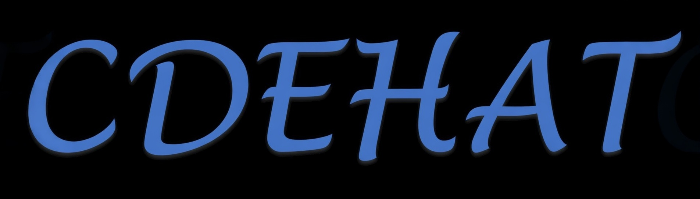

    

## CDEHAT: Conditional Diffusion-Assisted Enhanced Hybrid Attention Transformer for Remote Sensing Imagery Super-Resolution

Our paper was accepted on **March 3, 2026**.

The publicly available **code** and newly created **dataset CA-2022-S2-NAIP** are being compiled and uploaded... 

expected to be completed within two business days: **March 3 and March 4, 2026**

**Finally, we thank the editors and reviewers for their work on this paper.**

    

