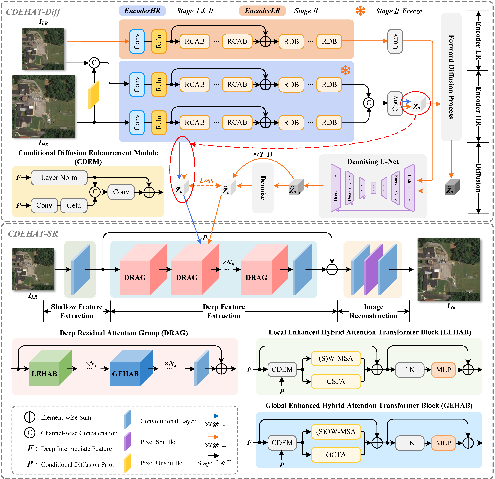

<p align="center">
    
</p>


## CDEHAT: Conditional Diffusion-Assisted Enhanced Hybrid Attention Transformer for Remote Sensing Imagery Super-Resolution

[Paper](https://doi.org/10.1016/j.isprsjprs.2026.03.002) | [PDF](https://doi.org/10.1016/j.isprsjprs.2026.03.002)


## <a name="update"></a>:dna:Network
 <p align="center">
    
</p>

The model architecture is located [here](SR/super_resolution/archs/cdehat_arch.py). Please star our work if it's helpful.


## :book:Table Of Contents

- [Installation](#installation)
- [Quick Start](#quick_start)
- [Train](#train)
- [Inference](#inference)
- [Visual Results Display](#visual_results)


## <a name="update"></a>:new:Update
Our paper was accepted on **March 3, 2026**.

You can find our CDEHAT model architecture and training framework codes in the `SR` folder; you can also visualize the Local Attribution Map (LAM) of SR models in `LAM` folder.

## <a name="installation"></a>:gear:Installation
```shell
# clone this repo
git clone https://github.com/cerulean136/CDEHAT.git
cd CDEHAT

# create an environment with python >= 3.9
conda create -n cdehat python=3.9
conda activate cdehat
pip install -r requirements.txt

# enter SR directory
cd SR
```


## <a name="quick_start"></a>:flight_departure:Quick Start

Download [temp.pth](https://github.com/cerulean136/CDEHAT/releases/download/demo_v1.0.0/temp.pth) to `weights/`, then run the following command to begin the model inference demonstration.
```shell
python -m super_resolution.test -opt super_resolution/options/test/demo.yml
```
Alternatively, you can run our script `begin_test_in_run_window.py` to quickly perform model inference.

The testing results will be saved in the `./results` folder.

You can now put your own remote sensing image data into the `./demo` folder to perform SR reconstruction.


## 🎁 Dataset
Please download the following remote sensing benchmarks:

Our [CA-2022-S2-NAIP](https://zenodo.org/records/18869850) benchmark is now publicly available on Zenodo.

| Data Type | [AID](https://captain-whu.github.io/AID/) | [DOTA-v1.0](https://captain-whu.github.io/DOTA/dataset.html) | [DIOR](https://www.sciencedirect.com/science/article/pii/S0924271619302825) | [UC Merced Land Use](https://vision.ucmerced.edu/datasets/) | [WHU-RS19](https://captain-whu.github.io/BED4RS/) | [CA-2022-S2-NAIP](https://zenodo.org/records/18869850)|
| :----: | :-----: | :----: | :----: | :----: |:----:|:----:|
|Training | [Download](https://captain-whu.github.io/AID/) | None | None | None | None | [Download](https://zenodo.org/records/18869850) |
|Testing | [Download](https://captain-whu.github.io/AID/) | [Download](https://captain-whu.github.io/DOTA/dataset.html) | [Download](https://drive.google.com/drive/folders/1UdlgHk49iu6WpcJ5467iT-UqNPpx__CC) | [Download](https://www.kaggle.com/datasets/abdulhasibuddin/uc-merced-land-use-dataset) | [Download](https://www.kaggle.com/datasets/sunray2333/whurs191) | [Download](https://zenodo.org/records/18869850) | 


## <a name="train"></a>:stars:Train

### Stage 1

First, we train a EncoderHR, which will be used to guid the training of stage 2.

1. Determine the paths to the training and validation sets, as well as the file types to use. For example:

    ```txt
    /train/
        category 1/image_1.jpg
        category 1/image_2.jpg
        ...
        category 2/image_1.jpg
        ...
    /val 1/
        category a/img_3.png
        category a/img_4.png
        ...
        category b/img_2.png
        ...
    /val 2/
        1.tif
        2.tif
        ...
    ```

2. Fill in the [training configuration file](SR/super_resolution/options/train/train_CDEHAT_MSE_SRx4_trained_on_AID.yml) with appropriate values. `dataroot_gt` and `suffix`. (The training configuration file must have the `dataroot_gt` parameter. `dataroot_lq` can be omitted; when omitted, it defaults to generating LQ images from the ground truth (GT) images during training.)

3. A suitable `encoder_iter` is determined by the training set size and the number of iterations. It can be 1/4 of the total number of iterations.

4. Start training!

    ```shell
    cd SR
    python -m super_resolution.train -opt super_resolution/options/train/train_CDEHAT_MSE_SRx4_trained_on_AID.yml
    ```

    Alternatively, you can run our script `begin_train_in_run_window.py` to quickly perform model training.

### Stage 2

1. Change the configuration file parameter `pretrain_network_g` to the model weight path for stage 1.

2. Change the `encoder_iter` configuration parameter to -1.

3. Start training!

    ```shell
    cd SR
    python -m super_resolution.train -opt super_resolution/options/train/train_CDEHAT_MSE_SRx4_trained_on_AID.yml
    ```

   Alternatively, you can run our script `begin_train_in_run_window.py` to quickly perform model training.

4. The final weights can be used for model testing and evaluation.


## <a name="inference"></a>:crossed_swords:Inference

Refer to `./super_resolution/options/test` for the configuration file of the model to be tested, and prepare the testing data and pretrained model.  

Then run the following codes:

```shell
cd SR
python -m super_resolution.test -opt -opt super_resolution/options/test/test_CDEHAT_MSE_SRx4_trained_on_AID.yml
```

Alternatively, you can run our script `begin_test_in_run_window.py` to quickly perform model inference.

The testing results will be saved in the `./results` folder.  

Please note that the test configuration file parameters `dataroot_gt` and `dataroot_lq` are used individually. When using `dataroot_gt`, the ground truth (GT) images for the test set are automatically generated into lq images by the data processing flow during the test. When using `dataroot_lq`, the test images are the lq images for the test set.


## <a name="visual_results"></a>:eyes:Visual Results Display

### Visual on DOTA
 

### Visual on CA-2022-S2-NAIP


## Acknowledgement

This project is based on [HAT](https://github.com/XPixelGroup/HAT), [DiffIR](https://github.com/Zj-BinXia/DiffIR) and [BasicSR](https://github.com/XPixelGroup/BasicSR). Thanks for their awesome work.


## Contact

If you have any questions, please feel free to contact with me at cerulean136@outlook.com


## Citation

Please cite us if our work is useful for your research.

```
@article{WU2026488,
title = {CDEHAT: Conditional Diffusion-Assisted Enhanced Hybrid Attention Transformer for remote sensing imagery super-resolution},
author = {Xiande Wu and Rui Liu and Wei Wu and Haiping Yang and Liao Yang},
journal = {ISPRS Journal of Photogrammetry and Remote Sensing},
volume = {235},
pages = {488-510},
year = {2026},
issn = {0924-2716},
doi = {https://doi.org/10.1016/j.isprsjprs.2026.03.002},
}
```
